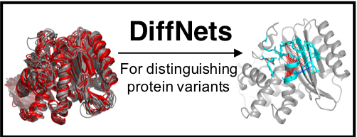

diffnets
==============================
[//]: # (Badges)
[](https://travis-ci.com/REPLACE_WITH_OWNER_ACCOUNT/diffnets)
[](https://codecov.io/gh/REPLACE_WITH_OWNER_ACCOUNT/diffnets/branch/master)



Supervised and self-supervised autoencoders to identify the mechanistic basis for biochemical differences between protein variants.

## Reference

If you use 'DiffNets' for published research, please cite us:

M.D. Ward, M.I. Zimmerman, S. Swamidass, G.R. Bowman. [DiffNets: Self-supervised deep learning to identify the mechanistic basis for biochemical differences between protein variants.](https://www.biorxiv.org/content/10.1101/2020.07.01.182725v1) bioRxiv. DOI: 10.1101/2020.07.01.182725, 2020.

## Dependencies

-python 3.6

-scipy, sklearn

-enspara -> which requires (MDTraj=1.8,numpy=1.14,cython, mpi4py)

-pytorch

## Recommended Installation

Follow line-by-line instructions [here.](https://diffnets.readthedocs.io/en/latest/Installation.html)

While the above install should be simple to follow, a more concise install is in the works.

## Building the docs / Running the tests

DiffNets uses sphinx for documentation. They are a work in progress, but can be found [here.](https://diffnets.readthedocs.io/en/latest/)

## Running the tests

Testing is in early stages. We use pytest.

```bash
cd tests
pytest
```

## Brief tutorial

For a brief tutorial on how to use DiffNets as a command line interface (cli) please visit our documnetation page [here.](https://diffnets.readthedocs.io/en/latest/Tutorial.html) We recommend using the CLI to get started with diffnets.

For examples on how to use the API, view docs/example_api_scripts

### Copyright

Copyright (c) 2020, Michael D. Ward, Bowman Lab


#### Acknowledgements
 
Project based on the 
[Computational Molecular Science Python Cookiecutter](https://github.com/molssi/cookiecutter-cms) version 1.3.

