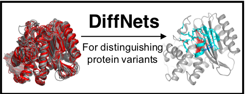

diffnets
==============================
[//]: # (Badges)
[](https://travis-ci.com/REPLACE_WITH_OWNER_ACCOUNT/diffnets)
[](https://codecov.io/gh/REPLACE_WITH_OWNER_ACCOUNT/diffnets/branch/master)



Supervised and self-supervised autoencoders to identify the mechanistic basis for biochemical differences between protein variants.

## Reference

If you use 'DiffNets' for published research, please cite us:

M.D. Ward, M.I. Zimmerman, A. Meller, M. Chung, S. J. Swamidass, G.R. Bowman. [Deep learning the structural determinants of protein biochemical properties by comparing structural ensembles with DiffNets.](https://www.nature.com/articles/s41467-021-23246-1) Nat Commun. DOI: 10.1038/s41467-021-23246-1.

## Dependencies

-python >=3.11

-scikit-learn

-pyyaml

-pytest

-click

-pytorch + torchvision

-enspara -> which requires (numpy, mdtraj, scipy, cython, pandas, matplotlib, mpi4py)

## Recommended Installation

Follow line-by-line instructions [here.](https://diffnets.readthedocs.io/en/latest/Installation.html) (Note: The docs need to be updated - follow install instructions below)

Create a new conda environment and activate it:
```bash
conda create -n diffnets python=3.12
conda activate diffnets
```

DiffNets is currently built on top of enspara, so you will need to install that first:
```bash
cd /path/for/packages
git clone https://github.com/bowman-lab/enspara
cd enspara
pip install -e .
```
This will also bundle most of the dependencies that DiffNets requires.

Next, install pytorch and mpi4py:
```bash
env MPICC=/path/to/mpi/implementation/mpicc pip install --no-cache-dir --no-binary=mpi4py mpi4py
pip install torch==2.13.0 torchvision==0.28.0 --index-url https://download.pytorch.org/whl/cu126
```

Now you can clone the repo and install DiffNets:
```bash
cd /path/for/packages
git clone https://github.com/bowman-lab/diffnets
cd diffnets
pip install -e .
```


## Building the docs / Running the tests

DiffNets uses sphinx for documentation, located [here.](https://diffnets.readthedocs.io/en/latest/)

## Running the tests

Testing is in early stages. We use pytest.

```bash
cd tests
pytest
```

## Brief tutorial

For a brief tutorial on how to use DiffNets as a command line interface (cli) please visit our documnetation page [here.](https://diffnets.readthedocs.io/en/latest/Tutorial.html) We recommend using the CLI to get started with diffnets.

For examples on how to use the API, view docs/example_api_scripts

### Copyright

Copyright (c) 2020, Michael D. Ward, Bowman Lab


#### Acknowledgements
 
Project based on the 
[Computational Molecular Science Python Cookiecutter](https://github.com/molssi/cookiecutter-cms) version 1.3.

